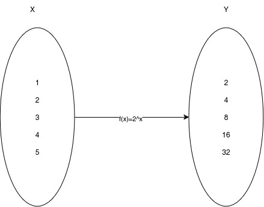

Title:  Functors in Python 
Date: 2024-09-12
Modified: 2024-09-25
Author: Lau Sandt
Summary: A look at how to implement Functors in Python

## Functors in Python
---
If you are like me and love to program both in Python and in Haskell, then you might stumble on some attempts to implement a functor in Python. I always wonder why, Python is not and will never be a functional language. Concepts as functors and monads have little use in an imperative language where side effects are the norm, not the exception. If you feel like writing functional code, write in a functional language, like Haskell, Lisp or Scala. 

However you might just be curious and want to know what a functor is and what its uses are, but you can't be bothered to learn a functional languager and why not? In that case you might stumble on this example, adopted slightly from [Arjan Codes](https://www.arjancodes.com/blog/python-functors-and-monads/), I added some code to keep it simple and make the example work, so you can follow along.  


```python
from typing import Generic, TypeVar, Callable, Iterable, Iterator
from operator import pow, add 
from functools import partial

T = TypeVar('T')
U = TypeVar('U')

class Functor(Generic[T]):
    def __init__(self, value: T):
        self.value = value

    def map(self, f: Callable[[T], U]) -> "Functor[U]":
        return Functor(f(self.value))

Functor(1).map(partial(add, 1)).map(partial(pow,2)).value == 4
```

I have several problems with this example and the article. For instance, I would suggest their motivation for a functor is at best secondary. I also find their implementation of the functor not great; they use a class where I would use an abstract base class. Finally, their implementation of a Monad is not a Monad. I think you can do better, but before I attempt to explain a Functor in Python, I first want to say that this article in no manner whatsoever suggests the Arjan Codes is bad; it is probably excellent and worth your attention. I have no opinion on the content of this site other than on this article. 

Functors are mappings
--- 

Understanding functors is not complicated. Yes functors are a concept from category theory, yes when talking about functors in the context of programming we are talking about endofunctors, indeed there are morphisms involved, and yes some abstract math is involved, but none of that really matters when you want to understand a functor. A functor is simply a mapping, you can understand a functor best by understanding Python's regular map function and its limitations. Let's look at the Python map function in action:   


```python
list(map(partial(pow,2), [1,2,3,4,5])) ==  [2, 4, 8, 16, 32]
```


**A map object**    
Before we look at what this map function does, we need to understand the implementation detail of the map function in Python because it will be a bit confusing not to. Python's map function has the following signature, which I have adapted slightly to include typing. 

```
map(func: Callable, iterable:Iterable) -> Iterator:
```
The map function accepts as arguments a function, an iterable, and returns an iterator. For the purpose of this discussion, further information on iterables and iterators is not necessary, so I will omit it.


```python
map(partial(pow,2), [1,2,3,4,5])
```


    <map at 0x7f527c67f310>


What does the above map function do? It maps the $2^x$ function on the domain {1,2,3,4,5} to
the codomain {2,4,8,16,32}. Pictorial it is this familiar drawing, which we all probably know from a secondary school math class:



We map our function to all elements in domain X and to elements in domain Y. In the example above, the structure of both domains is a list. That neatly brings me to a definition of the map function.

A map in mathematics refers to a special kind of function, a **homomorphism**, which is a structure-preserving function between structures of the same type. The term endofunctor, which Arjan codes uses, is basically the same but applied to category theory instead of algebra, but as algebraic structures are really categories, there is no difference. I am boring you, so let define a programming map function as:

**Definition map: A structure-preserving function between two sequences of the same type** 

I prefer to use the term sequence (an enumerated collection of objects) instead of an iterable, as the latter is a very specific Python term. 

If you are only interested in the Python implementation of the functor, you can stop reading, for Python `map` is the functor! Nothing you didn't know already, except maybe that the use of `map` is not advised by Python. You should use a generator or list comprehension instead.  


```python
[2**x for x in range(1,6)] == [2, 4, 8, 16, 32]
```

There are several advantages to using the generator (a list comprehension is just a special case of a generator), the code is easier to read, and you get to use guards.

```python
from doctest import testmod
def even(n: int) -> bool:
    '''
    0 is even 
    1 is not even 
    2 is even
    >>> even(0)
    True
    >>> even(1)
    False
    >>> even(2)
    True
    '''
    return n % 2 == 0

testmod() == TestResults(failed=0, attempted=3)
```

```python
[2**x for x in range(1,6) if even(x)] == [4, 16]
```

I can do the same with `map`, it is a matter of preference I would say.


```python
list(map(lambda x: 2**x, filter(lambda x : even(x), [1,2,3,4,5]))) == [4, 16]
```

#### A generalisation of map
If you are still interested in the functor and you are not put off by the fact that Python is not a functional language, then continue reading. A functor is, in all intents and purposes, a generalisation of `map`. It is a generalisation on the structure. A functor allows you to map over more than iterables / sequences. 

Consider a list as wrapping elements in a structure; in languages like Haskell (purely functional) and Scala (functional), you know other wrapped types that you can't iterate over, simply because next has no meaning for these types. The map function would not work on these wrapped types. The example most commonly used to explain those wrapped types is the Maybe type. In Haskell defined as such:

```haskell
data Maybe a = Nothing | Just a
```
This you should interpret pretty must as you read it. We have Maybe value which wraps an unspecified type, a. That Maybe value consists of one of two things:

- Nothing
- Just a value of that type

For instance we can have Maybe Int.

- Nothing
- Just 42

We can't use `map` here; `map` needs a sequence after all; there are no sequences here. How can we generalise our map function to also be able to use it on a Maybe type? We want to apply a function to the element and not the structure. Haskell's answer to this problem is to use a Java-like interface (akin to an abstract base class in Python); in Haskell, an interface is called a typeclass. We declare the Maybe type to be an instance of the Functor typeclass. 

```haskell
class Functor f where
  fmap :: (a -> b) -> f a -> f b
```

In Python, fmap is referred to as an abstract method, as it lacks an adjoining implementation. For the Maybe type to be an instance (implementing or subclassing) of the typeclass, as in Python or Java, we would have to give a meaning to fmap for the Maybe type:

```haskell
instance Functor Maybe where
  fmap f Nothing = Nothing
  fmap f (Just a)  = Just (f a)
```
Again, Haskell, so just a bit of clarification. It says for the Maybe type, if fmap a function (f) on a Nothing value, we get a Nothing back. If we fmap function f on the (Just a) value, we get a Just value back, and we apply f on the wrapped value a. If you run the following in GHCI (the Haskell interpreter, also available online at https://www.tryhaskell.org/ you will get the following:

```haskell
fmap (+1) (Just 41) = Just 42
```

A Haskell list implements the Functor typeclass. So I want to use fmap to map over a list I can. 

```haskell
fmap (+1) [1..5] = [2,3,4,5,6 ]
```

For those curious the list implementation of the Functor type class is:

```haskell
instance Functor [] where
  fmap f [] = []
  fmap f (a:as) = f a : fmap f as
```

Haskell uses a lot of pattern matching (Python is starting to), but it basically says if I fmap f on an empty list, I get that list back; if I fmap f on a list represented as `(a:as),` then I apply the function to a and cons that on a recursive call to fmap. If you do not understand that sentence, do not worry; we are programming in Python, not Haskell.

Let's see if we can implement this in Python:


```python
from abc import ABC, abstractmethod


class Maybe(ABC, Generic[T]):
    
    @abstractmethod
    def map(self):
        ...

class Just(Maybe[T]):

    def __init__(self, value: T): 
        self.value = value

    def map(self, func: Callable[[T], U]) -> Maybe[U]:
        try:
            new_value = func(self.value)
            return Just(new_value)
        except Exception as e:
            print(e)
            return Nothing()

    def unwrap(self) -> U:
        return self.value

    def __repr__(self) -> str:
        return f"{self.__class__.__name__} {self.value}"


class Nothing(Maybe[T]): 

    def map(self, func: Callable[[T], U]) -> Maybe[U]: 
        return self

    def __repr__(self) -> str: 
        return self.__class__.__name__
```


```python
Just(41).map(partial(add, 1)) == "Just 42"
```

```python
Nothing().map(partial(add,1))  == "Nothing" 
```

#### Use case
The question you should now be asking is: Do I need this in Python? Can you give me a use case? To answer the first question, no, you can program just fine without functors in Python; if anything, to me, they seem to be alien to the language. The answer to the question to the second question is sure. Imagine you have an API and you want an error message to propagate through a pipeline without stopping the pipeline. Using the following structure, we could achieve that quite easily: 


```python
class Either(ABC, Generic[T]):

    @abstractmethod
    def map(self):
        ...

class Right(Either[T]): 

    def __init__(self, value: T): 
        self.value: T = value 

    def map(self, func: Callable[[T], U]) -> Either[U]:
        try:
            new_val = func(self.value)
            return Right(new_val)
        except Exception as e:
            return Left(e.args[0]) 

    def unwrap(self) -> T: 
        return self.value
        
    def __repr__(self) -> str:
        return f"{self.__class__.__name__} {self.value}"


class Left(Either[T]): 

    def __init__(self, exc: str): 
        self.exc:str = exc 

    def map(self, func: Callable[[T], U]) -> Either[str]:
        return Left(self.exc)

    def unwrap(self) -> str:
        return self.exc

    def __repr__(self) -> str:
        return f"{self.__class__.__name__} {self.exc}"
```


```python
Right("42").map(int).map(lambda x : x / 0).map(str).map(int) == "Left division by zero"
```
    
Which we can unwrap of course for further use

```python
Right("42").map(int).map(lambda x : x / 0).map(str).map(int).unwrap() == 'division by zero'
```

#### Monad
In the article from Arjan's Code, they suggest their implementation of Maybe is a monad. It is not; it is a functor. This is an easy mistake to make, for a monad is a functor, but a functor is not a monad. to implement a monad requires the implementation of a `return`, `bind` or `liftM` function.

The monad is a very useful concept in a purely functional language, where you need to interact with an inpure world, or heavens forbid, you want a mutable state. Python is not a pure language and can interact excellently with an inpure world, and handles mutable states naturally. 

A monad you can understand as a toolkit to build programming patterns, very much like the iterator pattern. This side of the monad is very interesting and perhaps worth exploring further, even in Python. However, that requires a whole new article.

#### Conclusion
If you get asked about a functor in Python, just state that `map` is a limited functor and that Python has different solutions to tackle problems you would use a functor for in functional languages.

